

  

**NotedPo** is my very first fully deployed solo project. A simple yet functional note-taking / journaling web application.  

This project was a big step for me as it’s the first time that I’ve successfully deployed both frontend and backend only by solo. 
The sole purpose of this project is to test myself if I can do simple full working web application.

---

## What's in it?
- Write and save notes/journals online.  
- Responsive UI for both desktop and mobile.  
- Fully working backend API for note storage. (I used AI for backend whilst I'm just starting out learning python)
- **Form Integration:** When a user sends a question, the data is automatically recorded in my **Google Sheets file in real time**. (see the SSs below) 

---

## Pages & Screenshots  

### **Home**
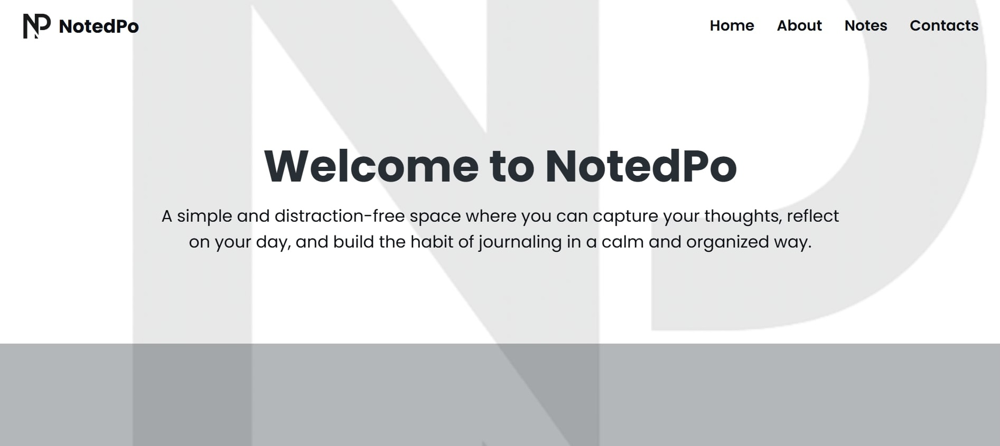

### **About**
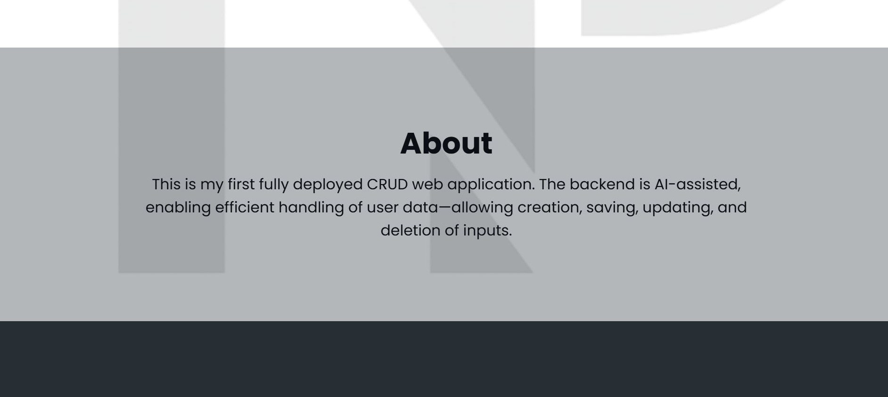

### **Notes**
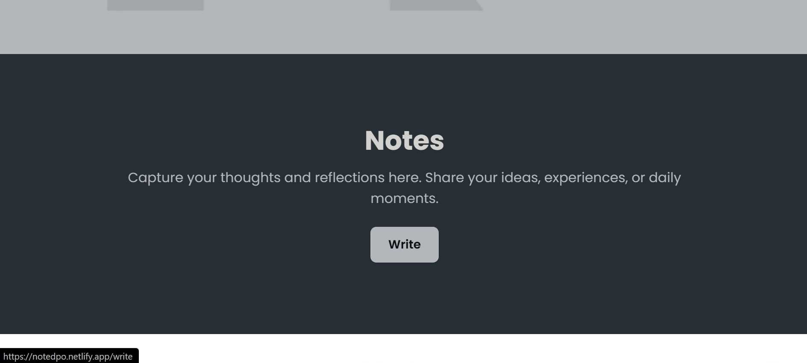

### **Write**
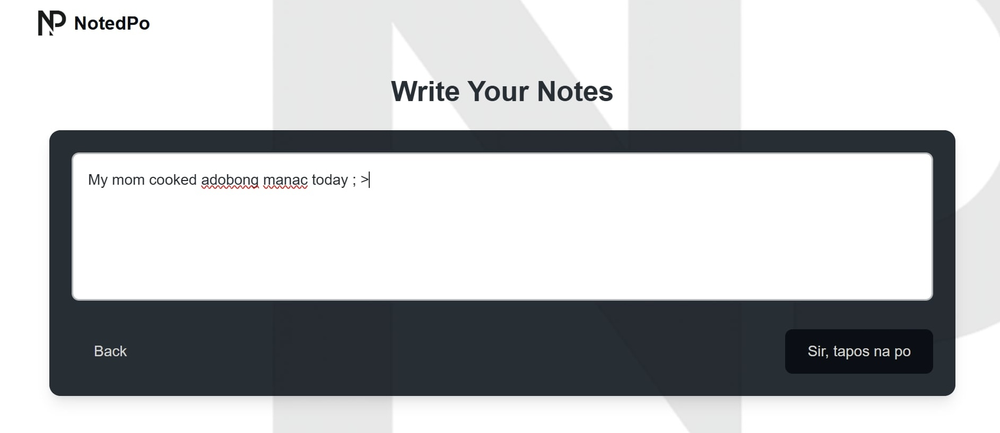

### **Saved Notes**
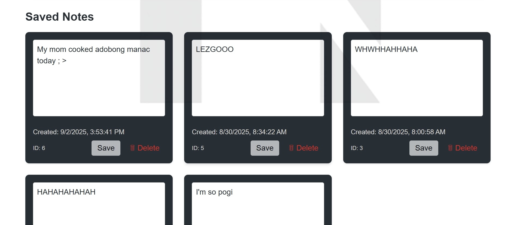

### **Queries**
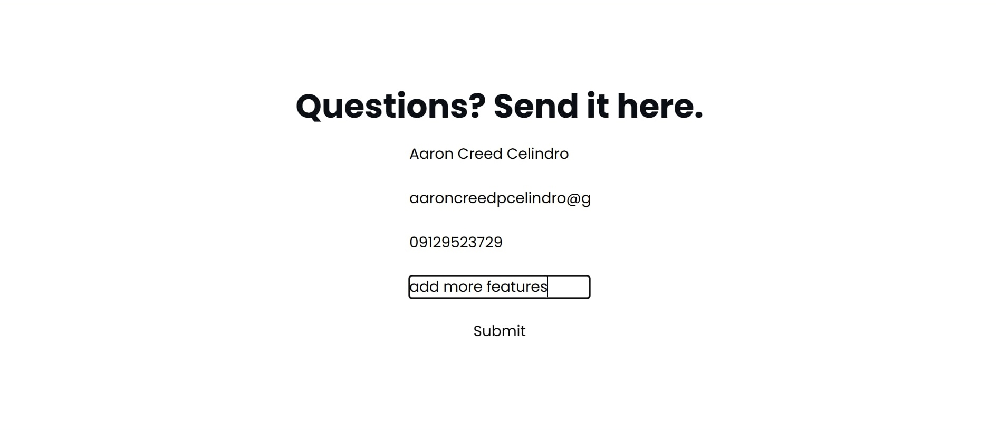

### **Queries to my sheets**

---

## Small Screen Responsiveness (mobile) 

  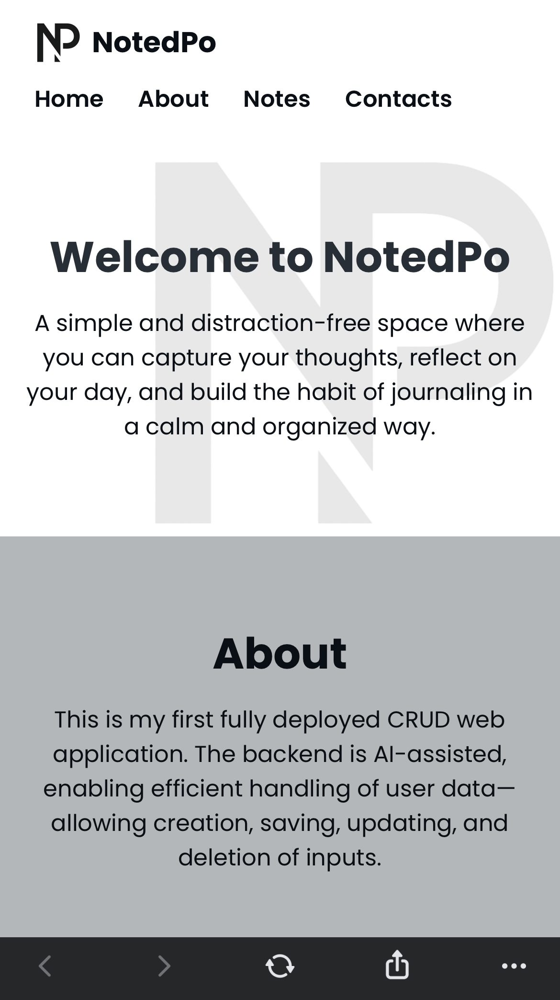
  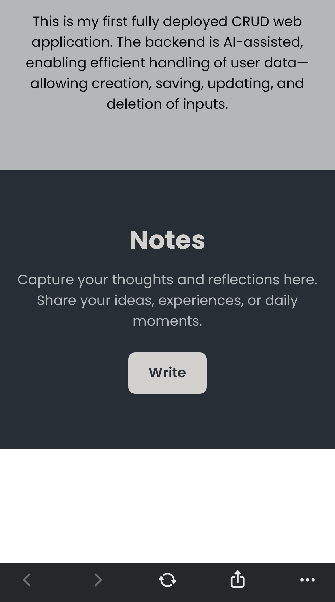
  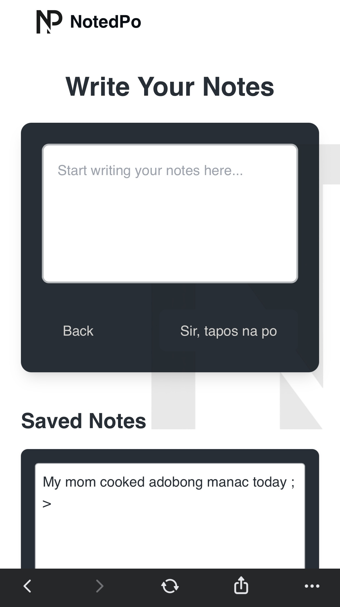
  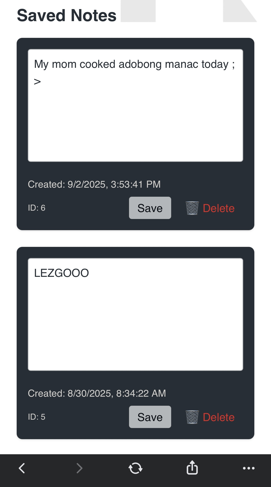
  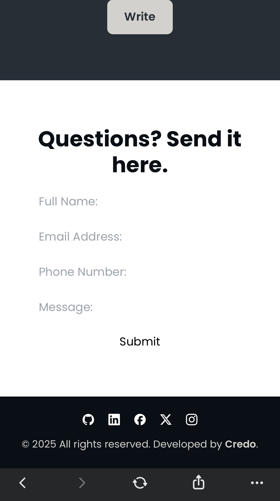

---

## Tech Stacks I used  

**Frontend:**  
- HTML, Tailwind CSS (cdn only), JavaScript  
- Deployed with Netlify 

**Backend:**  
- Flask 
- SQLite (for storing notes)  
- Deployed with Render  

---
